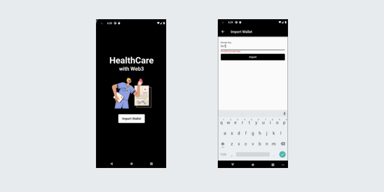

<strong>‼ The app flutter frontend isn't integrated with backend written in solidity </strong>
<h1>BlockChain Backend</h1>
<hr>
<p>This is a Solidity smart contract called HealthRecord. It is designed to store and manage health records for patients. 

```getRecordsCount```
The function is used to get the number of records that the patient has. It returns the length of the patient's records array.

```getRecord```
The function is used to get a specific record from the patient's records. It takes two parameters: the index of the record to retrieve and the Ethereum address of the healthcare provider that is requesting the record. It checks whether the healthcare provider has access to the patient's records and whether the index is valid. If the checks pass, it retrieves the record from the patient's records array and returns it.

```shareRecordAccess```
The function is used to grant access to the patient's records to a healthcare provider. It takes the Ethereum address of the healthcare provider as a parameter and sets the corresponding value in the sharedAccess mapping to true.

```revokeRecordAccess```
The function is used to revoke access to the patient's records from a healthcare provider. It takes the Ethereum address of the healthcare provider as a parameter and sets the corresponding value in the sharedAccess mapping to false.

```hasAccess```
The function is used to check whether a healthcare provider has access to a patient's records. It takes the Ethereum addresses of the patient and the healthcare provider as parameters and returns a boolean value that indicates whether the healthcare provider has access to the patient's records.
</p>

<hr>
<h1>Flutter Frontend</h1>
<hr>
<p>Flutter Frontend is kept simple and the UI have minimum number of elements.

```main.dart```
This is the main code of the application which implements the login page of the app using a stateless widget.

```insideapp.dart```
This page takes the input for the private key from the user and import the wallet, also checks if the private key is of correct bytes or not. 

```import.dart```
This page integrates the frontend and backend of the whole app using infura api keys.

```health.dart```
It have the definition of the variables of the struct created in the solidity backend. 


</p>